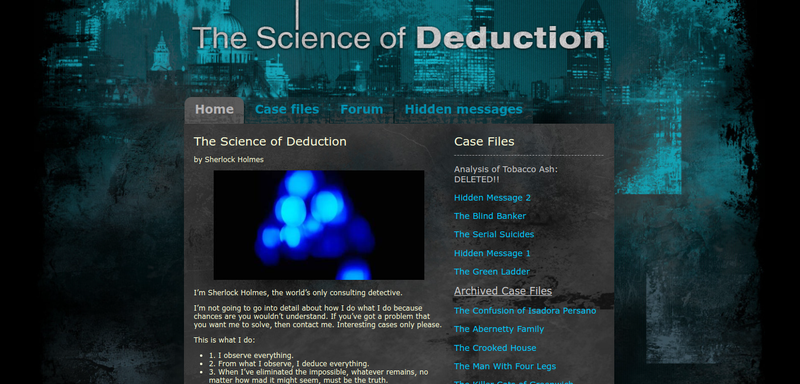

<div align="center">
  
  <h1><code>the-science-of-deduction</code></h1>
  <p>
    <strong>
      A collection of resources for learning the science of deduction 😜. <br/>
      A Sherlock fan-based blogging site.
      
    </strong>
  </p>
</div>

## Requirements

- [Golang](https://golang.org/dl/)
- [Docker](https://docs.docker.com/get-docker/) (Optional but recommended)
- [Postgresql](https://www.postgresql.org/download/) (**Only if you are not using `docker`**)

### Development

To get started, you can clone the repository and run the following commands:

```bash
git clone https://github.com/mrinjamul/the-science-of-deduction.git
```

To install the dependencies, run the following commands:

```bash
cd the-science-of-deduction
go mod download
```

Copy environment variables file and replace the values with your own.

```bash
cp .env.example .env
```

To run the application, run the following commands:

```bash
export $(cat .env | xargs)
go build
./the-science-of-deduction
```

To build the application (production), run the following commands:

```bash
go build
export $(cat .env | xargs)
./the-science-of-deduction
```

To start with logging into file,

```sh
(./the-science-of-deduction 2>&1 ) |& tee "output-$(date -I)-$RANDOM.log"
```

### License

- open sourced under the [MIT license](LICENSE)
